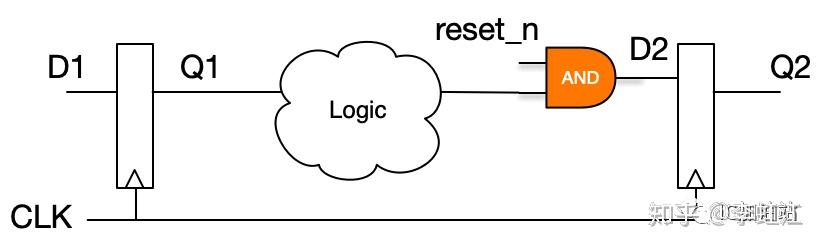
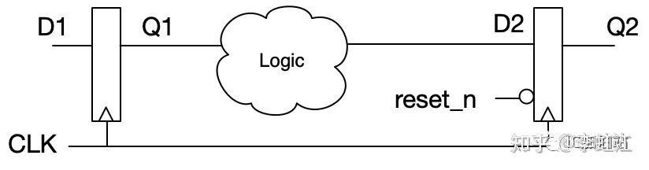
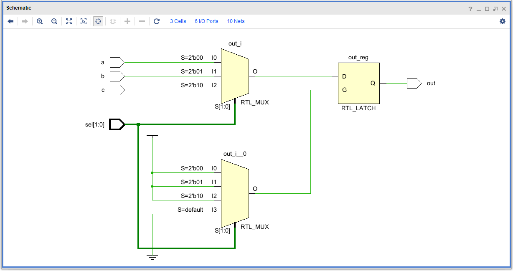
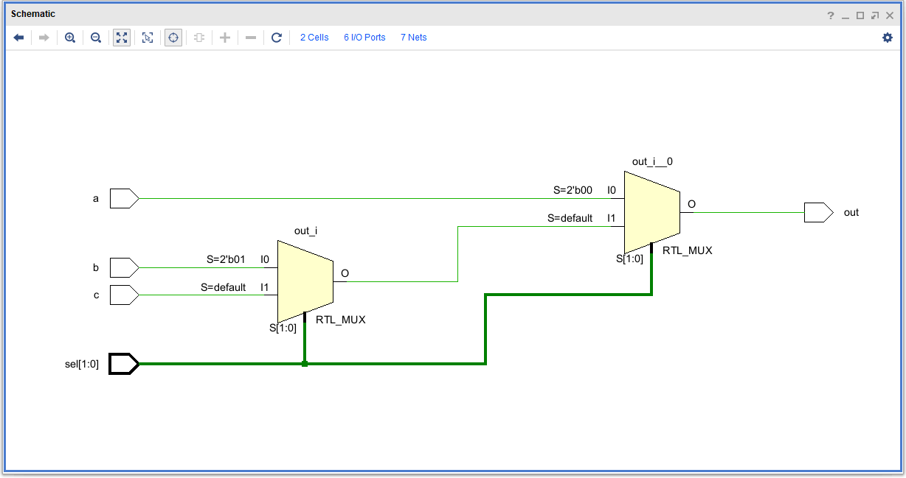
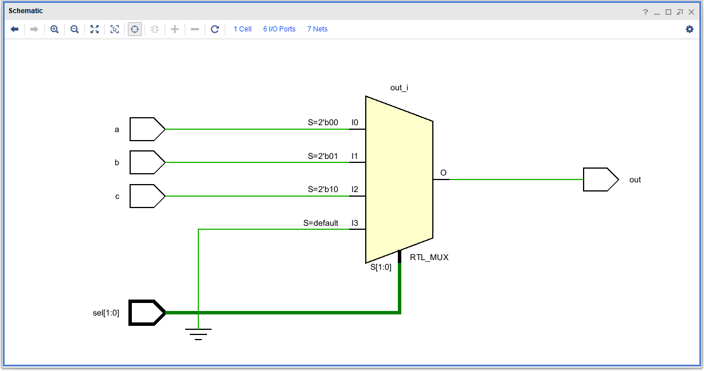
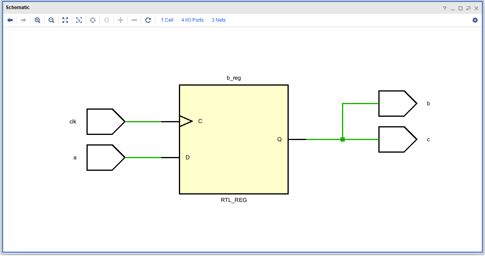
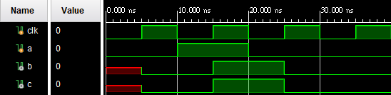
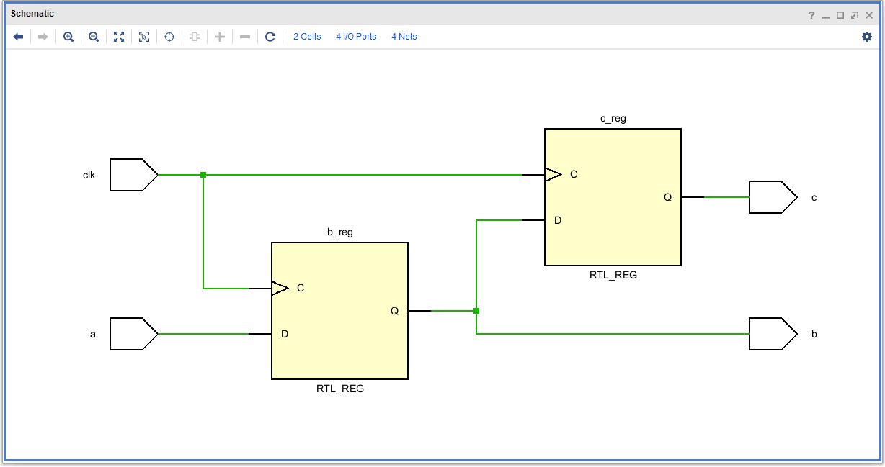
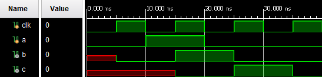

# Verilog相關

- [always @(posedge clk or negedge rst)中有寫negedge rst跟沒寫的差異](#always-posedge-clk-or-negedge-rst中有寫negedge-rst跟沒寫的差異)
- [case條件沒寫滿會合成什麼電路](#case條件沒寫滿會合成什麼電路)
- [case、if else差別](#caseif-else差別)
- [給code判斷是組合邏輯還是循序邏輯](#給code判斷是組合邏輯還是循序邏輯)
- [combinational、sequential電路差異](#combinationalsequential電路差異)
- [blocking/non blocking差異](#blockingnon-blocking差異)
- [同步和非同步電路差異](#同步和非同步電路差異)
- [除了用*來實現乘法外還有什麼方式可以實現](#除了用來實現乘法外還有什麼方式可以實現)
- [Reference](#reference)


## always @(posedge clk or negedge rst)中有寫negedge rst跟沒寫的差異

<details>
    <summary>Answer</summary>
    <p>沒寫在 sensitivity list 會是 Synchronous Reset，有寫則是 Asynchronous Reset。</p>
    <p>Synchronous Reset 在電路合成時會合成沒有復位接腳的FF，並且FF的輸入訊號會跟 Reset 訊號 AND 在一起。Asynchronous Reset 則是直接合成出帶有復位接腳的FF。</p>
</details> <br>

```verilog
always @(posedge clk) begin
    if (!rst_n) out <= 0;
    else out <= in;
end
```
<details>
    <summary>Schematic</summary>
    
</details> <br>

```verilog
always @(posedge clk or negedge rst_n) begin
    if (!rst_n) out <= 0;
    else out <= in;
end
```
<details>
    <summary>Schematic</summary>
    
</details> <br>


## case條件沒寫滿會合成什麼電路

```verilog
module case_x(
    input a,
    input b, 
    input c,
    input [1:0] sel, 
    output reg out
    );
    
    always @(*) begin
        case (sel)
            2'd0: out = a;
            2'd1: out = b;
            2'd2: out = c;
        endcase
    end
endmodule
```
<details>
    <summary>Answer</summary>
    <p>當條件沒有寫完整且出現沒有定義的條件時，輸出訊號會默認保持原樣，因此合成電路時會產生額外的記憶單元 Latch 及其控制訊號。</p>
    
    <a href="#caseif-else差別">case條件寫完整的電路</a>
</details> <br>


## case、if else差別

```verilog
module if_complete(
    input a,
    input b, 
    input c,
    input [1:0] sel, 
    output reg out
    );
    
    always @(*) begin
        if (sel == 0) out = a;
        else if (sel == 1) out = b;
        else out = c;
    end
endmodule


module case_complete(
    input a,
    input b, 
    input c,
    input [1:0] sel, 
    output reg out
    );
    
    always @(*) begin
        case (sel)
            2'd0: out = a;
            2'd1: out = b;
            2'd2: out = c;
            default: out = 0;
        endcase
    end
endmodule
```
<details>
    <summary>Answer</summary>
    <p>case、if else 的差別在於 if else 具有階層性，條件寫得越上面的具有越高的優先權，因此會生成多個2對1多工器串接在一起；case 則不具有階層性，會直接生成一個多對1多工器。</p>
    <h3>if else: </h3>
    
    <h3>case: </h3>
    
</details> <br>


## 給code判斷是組合邏輯還是循序邏輯

```verilog
always @(*) begin
    case (sel)
        2'd0: out = a;
        2'd1: out = b;
        2'd2: out = c;
        default: out = 0;
    endcase
end
```
<details>
    <summary>Answer</summary>
    <p>組合邏輯電路 (Combinational)</p>
</details> <br>

```verilog
always @(posedge clk) begin
    b <= a;
    c <= b;
end
```
<details>
    <summary>Answer</summary>
    <p>循序邏輯電路 (Sequential)</p>
</details> <br>

```verilog
always @(a, b, sel) begin
    if (sel) c = a;
    else c = b;
end
```
<details>
    <summary>Answer</summary>
    <p>組合邏輯電路 (Combinational)</p>
</details> <br>

```verilog
always @(posedge clk or negedge rst_n) begin
    if (!rst_n) out <= 0;
    else out <= in;
end
```
<details>
    <summary>Answer</summary>
    <p>循序邏輯電路 (Sequential)</p>
</details> <br>

```verilog
assign c = a + b;
```
<details>
    <summary>Answer</summary>
    <p>組合邏輯電路 (Combinational)</p>
</details> <br>


## combinational、sequential電路差異

<details>
    <summary>Answer</summary>
    <p>Combinational (組合電路)是由邏輯閘組合而成，因其不包含記憶單元和反饋線，所以輸出只與當前輸入有關，也就是說電路內的任何訊號變動會<strong>直接</strong>反映在其他訊號上，不會有時脈進行同步</p>
    <p>Sequential (循序電路)使用latch、flip-flop來暫存資料或狀態，輸出與當前輸入、先前輸入輸出有關，會依賴系統時脈來更新訊號的值。</p>
</details> <br>


## blocking/non blocking差異

```verilog
// blocking
 always @(posedge clk) begin
    b = a;
    c = b;
end

// non-blocking
always @(posedge clk) begin
    b <= a;
    c <= b;
end
```
<details>
    <summary>Answer</summary>
    <p></p>
    <h3>blocking: </h3>
    
    
    <h3>non-blocking: </h3>
    
    
</details> <br>


## 同步和非同步電路差異


## 除了用*來實現乘法外還有什麼方式可以實現


## Reference
- [Synchronous & Asynchronous Reset](https://hackmd.io/@jesse1282/B1tgS0q62)
- [多種時序邏輯always語句的綜合結果與分析](https://zhuanlan.zhihu.com/p/167305718)
- [Reset信號如何同步？](https://zhuanlan.zhihu.com/p/533949746)
- [組合電路與序向電路的差異](https://caslab.ee.ncku.edu.tw/dokuwiki/_media/course:ldl:108b:laboratory-12.pdf)
- [第5章 組合電路](https://www.google.com/url?sa=t&rct=j&q=&esrc=s&source=web&cd=&ved=2ahUKEwiqm5X6jouCAxUee_UHHZg1BdU4ChAWegQIBBAB&url=https%3A%2F%2Fmy.stust.edu.tw%2Fsys%2Fread_attach.php%3Fid%3D520849&usg=AOvVaw0Qp7R9Ie2F8Axjoqvw-vTH&opi=89978449)
- [第6章 循序電路](https://www.google.com/url?sa=t&rct=j&q=&esrc=s&source=web&cd=&cad=rja&uact=8&ved=2ahUKEwipv8Wqj4uCAxWVQ94KHYtSAyA4FBAWegQIAxAB&url=https%3A%2F%2Fmy.stust.edu.tw%2Fsys%2Fread_attach.php%3Fid%3D520850&usg=AOvVaw37Gd3xoRs2FdJOcQVm6APG&opi=89978449)